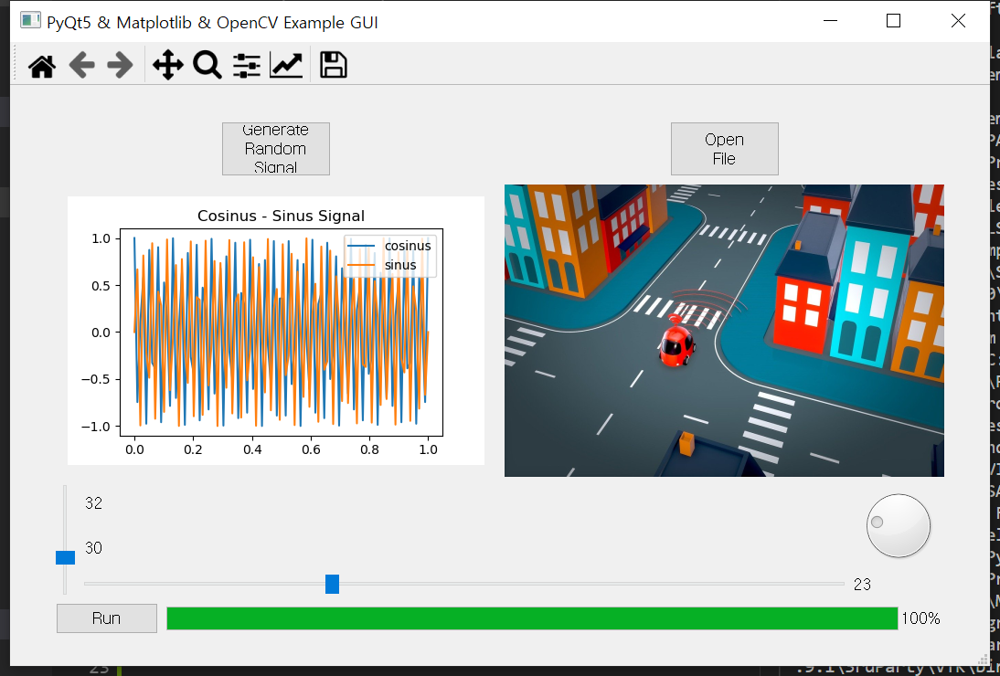

# PyGUIDevTemplate
GUI development template for python


## QT 를 이용한 GUI 설계
 * Matplotlib 적용
  - QWidget 클래스 이용 [reference](https://pythonspot.com/pyqt5-matplotlib/)
 * Qt designer 활용
  - custom widget
  - custom label
  - 배포시 *.ui 파일을 *.py 파일로 변환하여 import 한 후, 배포파일을 생성해야 ui 파일을 포함하여 빌드 가능 ([reference](https://nuovoman1048.tistory.com/entry/QT-Desinger-%ED%8C%8C%EC%9D%B4%EC%8D%AC-%EC%97%B0%EB%8F%99%ED%95%98%EB%8A%94-%EB%B0%A9%EB%B2%95ui%ED%8C%8C%EC%9D%BC-%EC%97%B0%EA%B2%B0))
  ```bash
  pyuic5 -x qt_designer.ui -o qt_designer.py
  ```
 * Opencv 모듈을 이용한 이미지 생성
  - QLabel 클래스 이용
  - file 접근시 반드시 영문 path 로 접근해야 함
   + 예외처리 완료

 * QT dial, slider 이용
  - [https://wikidocs.net/35495](https://wikidocs.net/35495)


## Pyinstaller 를 이용한 실행파일 생성 (for Windows)

```bash
pyinstaller main.py -F -w -i iconsample.ico
```



## TODO! 실행파일 생성 (for Linux Ubuntu)